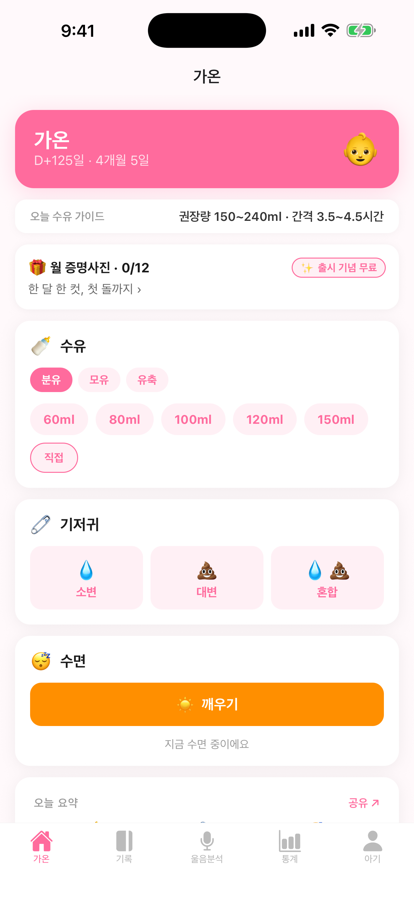
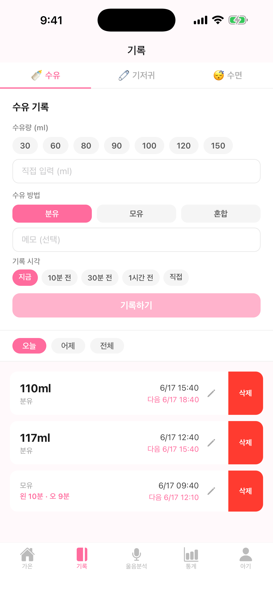
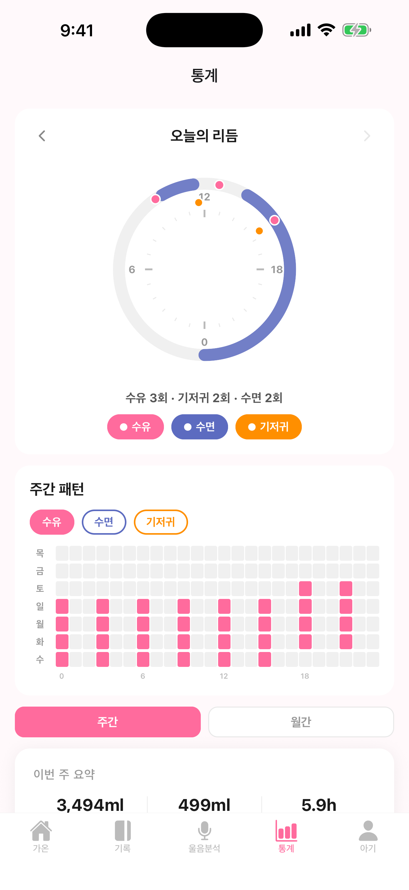
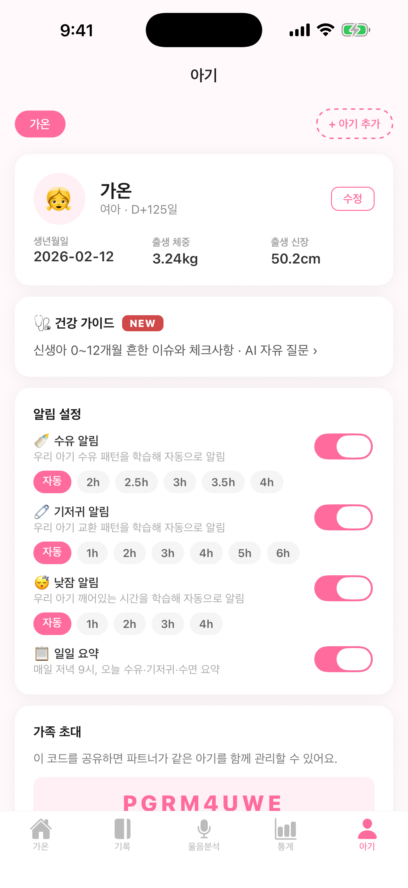

# 베이비로그 (BabyLog) — 신생아 케어 기록 앱

> 수유·기저귀·수면·성장을 한 손으로 빠르게 기록하고, **아기 울음을 온디바이스 AI로 분석**해요.
> 부부가 함께 실시간으로 공유하는 육아 로그.

<p>📱 iOS TestFlight 운영 중 · 🍼 온디바이스 울음분석(음성 미전송) · ⚙️ 백엔드 Spring Boot(Kotlin)·Railway</p>

## 📸 스크린샷

| 홈 (빠른 기록) | 기록 | 울음분석 | 통계 | 아기 |
|:---:|:---:|:---:|:---:|:---:|
|  |  |  |  |  |

> 스크린샷은 `docs/screenshots/` 에 추가됩니다(작업 예정).

## 한눈에

**베이비로그**는 잠 못 자는 신생아 부모를 위한 기록 앱입니다. 한 손·한 탭으로 빠르게 남기고, 패턴을 통계로 보고, 우는 이유까지 AI가 추정해 줍니다.

- **1탭 빠른 기록** — 수유 `↻ 다시` 반복, 기저귀 타일, 수면 토글
- **온디바이스 울음분석** — 5초 녹음 → 음향 특징 추출로 분류(배고픔/졸림/불편/트림/통증). **음성 파일은 저장·전송하지 않고 숫자 요약만** 서버로(프라이버시)
- **통계** — 24시간 리듬 차트·주간 패턴 히트맵·수유량/수면
- **부부 공유** — 가족 초대 코드로 실시간 동기화 + 다음 수유 시간 로컬 알림

## 🛠 기술 스택
Expo · React Native · TypeScript · **Expo 로컬 네이티브 모듈(Swift/Accelerate, `modules/cry-detector`)** · Spring Boot(Kotlin) · Railway · EAS(TestFlight)

---

## 스크린 구성

| 탭 | 설명 |
|----|------|
| 홈 | **빠른 기록** — 유형별 카드(수유·기저귀·수면) 3개, 수유는 `↻ 다시` 1탭 반복 버튼 + 보조 칩, 기저귀는 글자 라벨 타일. 모닝 브리프·다음 수유 시간·오늘 요약 |
| 기록 | 수유/기저귀/수면 **가로 페이징**(좌우 스와이프 + 슬라이딩 인디케이터), 세 화면 상시 마운트로 상태 보존. 행마다 연필 아이콘 명시적 수정 |
| 울음분석 | 5초 녹음 → 음향 feature + 컨텍스트로 분류 → 확인 시 개인화 학습 |
| 통계 | **주간/월간 토글**, 24시간 원형 리듬 차트, 주간 패턴 히트맵, 수유량·횟수·수면 |
| 아기 | 아기 프로필, 수유 가이드, 성장 기록, 알림 설정(일일 요약·합성 위험도 토글), 가족 초대 코드 |

## 울음 분석 (Phase 2A)

- **온디바이스 feature 추출**: 피치(F0, autocorrelation), ZCR, RMS envelope rhythmicity, infant_cry 신뢰도
- **음성 파일은 저장/전송 안 함** — 숫자 요약만 서버로 (프라이버시)
- **분류 로직**: 컨텍스트 prior (마지막 수유/기저귀/수면 경과) + 음향 규칙 + 과거 확정 샘플과의 similarity
- **학습 단계**: HEURISTIC → SIMILARITY(20+) → PERSONAL(50+)
- 라벨: 배고픔 / 졸림 / 불편함 / 트림 필요 / 통증 / 알 수 없음

네이티브 모듈은 `modules/cry-detector/`에 있음 (Expo 로컬 모듈 + Swift/Accelerate).

## 로컬 실행

```bash
npm install
npx expo start
```

iOS 시뮬레이터: `i` / Android: `a` / 실기기: Expo Go 앱으로 QR 스캔

## 환경변수

`app.config.ts`에서 API URL을 환경변수로 주입:

```bash
# 로컬 (기본값 localhost:8092 사용)
npx expo start

# 배포된 API 사용
BABY_LOG_API_URL=https://baby-log-api-production.up.railway.app npx expo start
```

## iOS TestFlight 배포

```bash
# 빌드 + TestFlight 업로드 한 번에
npx eas build --profile production --platform ios --auto-submit
```

식별자/자격증명/Gotcha는 `.claude/context.md` 참조. 요약:

- ASC 앱: `베이비로그-ai` (App ID `6764563994`)
- Bundle ID: `com.giwon.babylog`
- 자격증명은 EAS 서버에 저장돼 추가 입력 없음
- 첫 빌드는 ASC에서 수출 규정(암호화 사용 안 함) 한 번 답변 필요

테스터 추가는 https://appstoreconnect.apple.com/apps/6764563994/testflight/ios :

- **Internal Testing** (≤100명, 리뷰 없음): 부부/가까운 사람 — ASC 사용자 이메일 초대
- **External Testing** (≤10000명, Public Link 가능): 친구 공유 — 첫 빌드만 Beta App Review 1회

## 알림 · 실시간 공유

- 수유 기록 시 `nextFeedAt` 기준으로 로컬 알림 자동 등록
- 앱 시작 시 최신 수유 기록으로 알림 재동기화
- iOS: 권한 팝업 자동 요청 / Android: `feed-reminder` 채널
- **가족 실시간 동기화 (Phase 1+2, Build #4+)**: SSE(`/api/v1/families/{id}/stream`)로 다른 디바이스 기록을 30초 내 자동 새로고침. 백그라운드는 Expo Push로 전송(CREATED 이벤트만). `X-Device-Id` 로 자기 디바이스 푸시 제외
- **일일 요약 푸시** — 매일 21:00 KST 가족별 그날 통계(수유/기저귀/수면) + Gemini 자연어 본문

## iOS 위젯

- **systemMedium 홈 위젯** — 마지막 수유 / 다음 수유 / 오늘 요약
- **잠금화면 위젯(accessory)** — 마지막 수유 시각

## 가족 공유

1. 첫 번째 기기에서 **새 가족 시작하기** → 아기 등록
2. 아기 탭에서 **초대 코드** 확인 (8자리)
3. 두 번째 기기에서 **초대 코드로 참여하기** → 같은 데이터 공유

## 실기기 빌드 (Swift 네이티브 모듈 수정 시)

JS만 바꿨다면 Metro 핫리로드로 충분하고, Swift/Podfile/Info.plist를 수정했다면 Xcode 재빌드가 필요함.

```bash
cd ios
pod install  # Podfile/의존성 추가 시에만

xcodebuild -workspace BabyLog.xcworkspace -scheme BabyLog \
  -configuration Debug -destination "id=<DEVICE_UDID>" \
  -derivedDataPath build \
  CODE_SIGN_STYLE=Automatic DEVELOPMENT_TEAM=776H9NV6HT \
  -allowProvisioningUpdates build

xcrun devicectl list devices  # UDID 확인
xcrun devicectl device install app --device <UDID> \
  build/Build/Products/Debug-iphoneos/BabyLog.app
```

Pods Unicode 에러나면 `export LANG=en_US.UTF-8 LC_ALL=en_US.UTF-8` 먼저.

## 로드맵

- [x] 수유/기저귀/수면/성장/통계 + 가족 공유
- [x] 가족 실시간 동기화 Phase 1+2 (SSE + Expo Push, 자기 디바이스 제외)
- [x] 울음 분석 Phase 1 (휴리스틱 + 학습 스텁)
- [x] 울음 분석 Phase 2A (음향 feature 확장)
- [x] iOS 위젯 (systemMedium 홈 + 잠금화면 accessory)
- [x] 일일 요약 푸시(21:00 KST cron + Gemini)
- [x] 통계 탭 주간/월간 토글 + 24시간 리듬 차트 + 주간 패턴 히트맵
- [x] 빠른 기록 유형별 카드 재설계 (`QuickCard` + 직전값 1탭 반복)
- [x] 기록 탭 가로 페이징 전환 (스와이프 + 인디케이터)
- [x] **TestFlight 베타 운영 중 — Build #14 (2026-05-22), EAS 유료 플랜**
- [ ] 울음 분석 Phase 2B (YAMNet + Donate-a-Cry k-NN)
- [ ] Siri Shortcuts / Live Activity
- [ ] 데이터 export (PDF/CSV — 산부인과 방문용)

더 자세한 에이전트용 가이드는 [AGENTS.md](./AGENTS.md) 참고.
